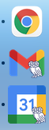

Tired of losing your Rice email and calendar in a see of Chrome tabs?  Follow the instructions below to make separate Chrome apps for both Rice Gmail and Rice Google Calendar.  These apps are separate from Chrome and much easier to access.



# Gmail

In Chrome, go to your Rice GMail.

Right click somewhere on the page, then click "Inspect".  Go to the "Console" tab of the window that pops up.

Copy and paste this at the console prompt, replacing 'example@rice.edu' with your email address:

```js
const email = 'example@rice.edu'
````
Hit enter.  Then copy and paste the following and hit enter:

```js
const startUrl = `https://mail.google.com/mail/u/?authuser=${email}`;
const name = 'Rice&nbsp;Gmail';
const description = 'Rice&nbsp;Gmail';
const logo = 'gmail_rice';

const unsanitizedHtmlPolicy = trustedTypes.createPolicy('unsanitizedHtml', {
  createHTML: (htmlString) => htmlString,
});

document.head
  .querySelector(':first-child')
  .insertAdjacentHTML(
    'beforebegin',
    unsanitizedHtmlPolicy.createHTML(
      `<link rel="manifest" href='data:application/manifest+json,{"start_url":"${startUrl}", "name":"${name}", "description": "${description}", "icons": [{ "src": "https://github.com/jpslav/my_mac/raw/master/logos/${logo}_512.png", "type": "image/png", "sizes": "512x512" }, { "src": "https://github.com/jpslav/my_mac/raw/master/logos/${logo}_256.png", "type": "image/png", "sizes": "256x256" }, { "src": "https://github.com/jpslav/my_mac/raw/master/logos/${logo}_128.png", "type": "image/png", "sizes": "128x128" }]}' />`,
    )
  );
```

Next, go to the three-dot menu in the upper right corner of Chrome.  Click "Cast, Save, and Share..." then click "Install Page as App".  

You should see "Rice Gmail" in the dialog box.  Click OK. 

To make this easy to reuse on Mac: Clicking OK should open a Finder window with you new app. Open it, and verify that it is your Rice Gmail. There should be an icon now for it in the Dock. Right-click on that icon, click on "Options", then select "Keep in Dock" so that it is always in your dock.

# Google Calendar

Ditto everything above except start from your Rice Google Calendar and replace the big pasted block of code with the following (again remembering to enter the first `const email = 'your_email@rice.edu'` line):

```js
const startUrl = `https://calendar.google.com/calendar/?authuser=${email}`;
const name = 'Rice&nbsp;Calendar';
const description = 'Rice&nbsp;Calendar';
const logo = 'gcal_rice';

const unsanitizedHtmlPolicy = trustedTypes.createPolicy('unsanitizedHtml', {
  createHTML: (htmlString) => htmlString,
});

document.head
  .querySelector(':first-child')
  .insertAdjacentHTML(
    'beforebegin',
    unsanitizedHtmlPolicy.createHTML(
      `<link rel="manifest" href='data:application/manifest+json,{"start_url":"${startUrl}", "name":"${name}", "description": "${description}", "icons": [{ "src": "https://github.com/jpslav/my_mac/raw/master/logos/${logo}_512.png", "type": "image/png", "sizes": "512x512" }, { "src": "https://github.com/jpslav/my_mac/raw/master/logos/${logo}_256.png", "type": "image/png", "sizes": "256x256" }, { "src": "https://github.com/jpslav/my_mac/raw/master/logos/${logo}_128.png", "type": "image/png", "sizes": "128x128" }]}' />`,
    )
  );
```

# Google Drive

Ditto everything above except start from your Rice Google Drive and replace the big pasted block of code with the following (again remembering to enter the first `const email = 'your_email@rice.edu'` line):

```js
  const startUrl = `https://drive.google.com/drive/u/?authuser=${email}`;
  const name = 'Rice&nbsp;Drive';
  const description = 'Rice&nbsp;Drive';
  const logo = 'drive_rice';

  const unsanitizedHtmlPolicy = trustedTypes.createPolicy('unsanitizedHtml', {
    createHTML: (htmlString) => htmlString,
  });

  document.head
    .querySelector(':first-child')
    .insertAdjacentHTML(
      'beforebegin',
      unsanitizedHtmlPolicy.createHTML(
        `<link rel="manifest" href='data:application/manifest+json,{"start_url":"${startUrl}", "name":"${name}", "description": "${description}", "icons": [{ "src": "https://github.com/jpslav/my_mac/raw/master/logos/${logo}_512.png", "type": "image/png", "sizes": "512x512" }, { "src": "https://github.com/jpslav/my_mac/raw/master/logos/${logo}_256.png", "type": "image/png", "sizes": "256x256" }, { "src": "https://github.com/jpslav/my_mac/raw/master/logos/${logo}_128.png", "type": "image/png", "sizes": "128x128" }]}' />`,
      )
    );
```

Sometimes right clicking to open the developer tools doesn't work in Drive. You can get to the developer tools via the View menu, then clicking Developer, then clicking Developer Tools.
